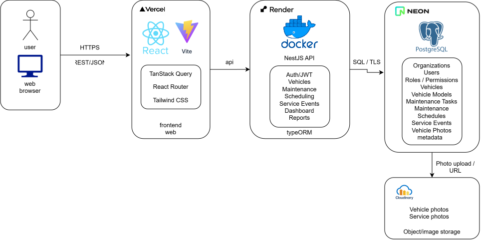

# Architecture Diagram

Deployment view of the system described in [`components_diagram.md`](./components_diagram.md).

---

- React: the screens the fleet team uses in the browser.
- Docker: packages the service so it runs the same on a laptop and on AWS.
- NestJS: the back-end API, where the business rules live.
  - Authentication: logs users in.
  - Vehicle Profiles: creates and edits vehicle records.
  - Maintenance Scheduling: defines when each vehicle is due for service.
  - Service Event Log: records the services actually performed.
  - Overdue Engine: compares the schedule against the log to flag what is overdue.
- PostgreSQL: stores vehicles, schedules and service events.
