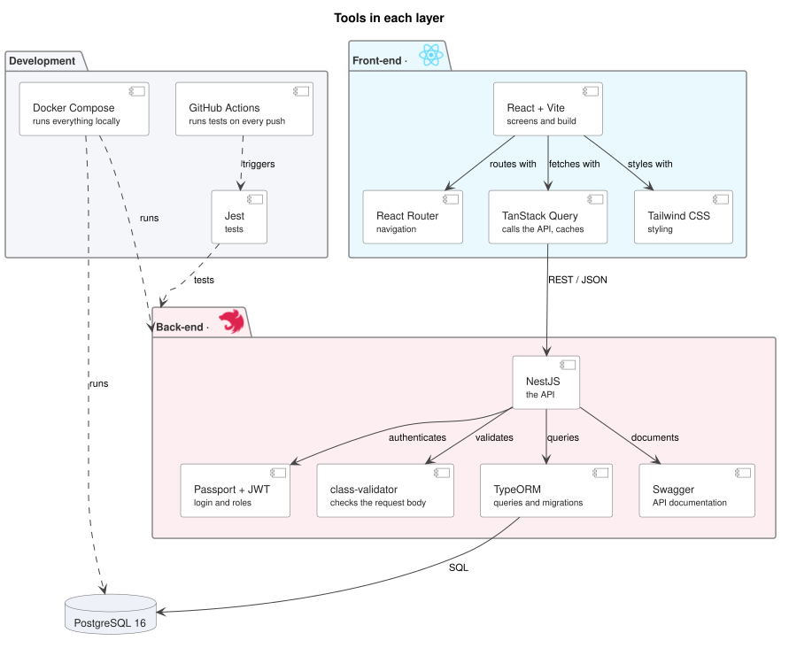

# Architecture

## Overview

React in the browser, a NestJS API in a Docker container, PostgreSQL for storage. The five API modules are in [`components_diagram.md`](./components_diagram.md); the tables are in [`data_model.md`](./data_model.md).

## Tools

| Layer | Tool | For |
|---|---|---|
| Front-end | React + Vite | Screens and build |
| | React Router | Navigation between the four screens |
| | TanStack Query | Calls the API and caches the answers |
| | Tailwind CSS | Styling, following the brand manual |
| Back-end | NestJS | The API |
| | Passport + JWT | Login and role permissions |
| | class-validator | Rejects a bad request before it reaches the service |
| | TypeORM | Queries and database migrations |
| | Swagger | API documentation, generated from the code |
| Data | PostgreSQL 16 | Storage |
| Development | Docker Compose | Runs API and database locally with one command |
| | Jest | Tests |
| | GitHub Actions | Runs the tests on every push |

These are the choices for the first delivery, not a commitment. Swapping TypeORM for Prisma, or moving off AWS, changes one layer and leaves the rest of the design intact.
