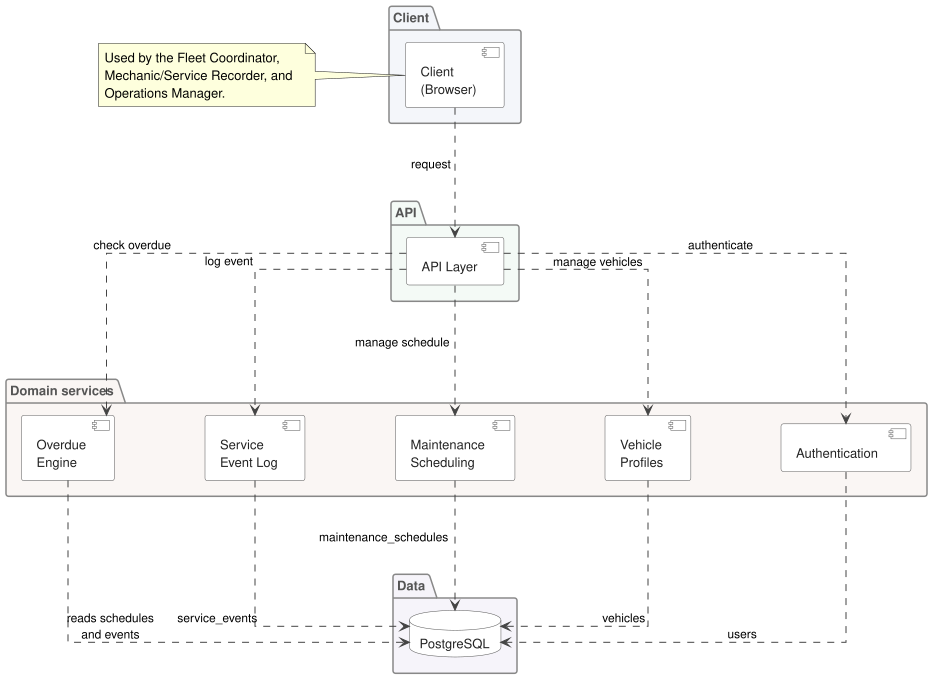
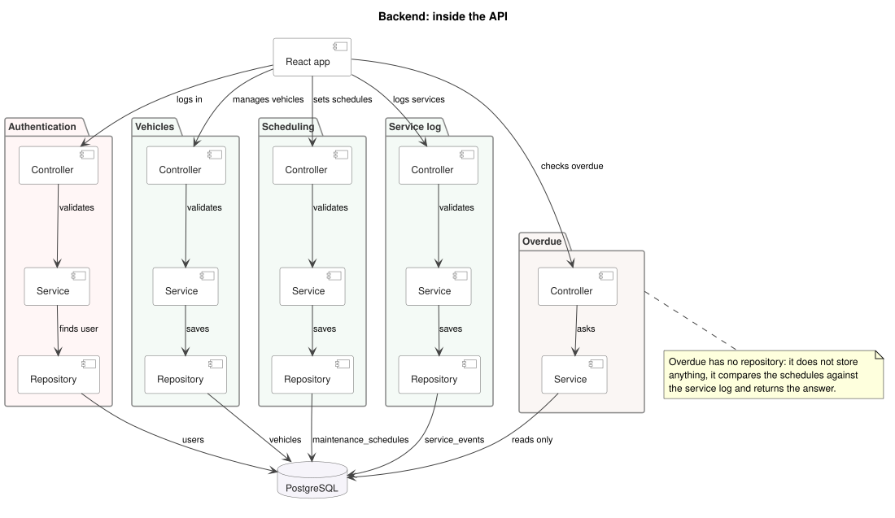

# Component Diagrams

## Containers

What runs and what talks to what: one web client, one API split into five services, one database.

## Backend

The same five services, opened up. Each one is a Controller, a Service and a Repository, except Overdue, which stores nothing and only reads.
