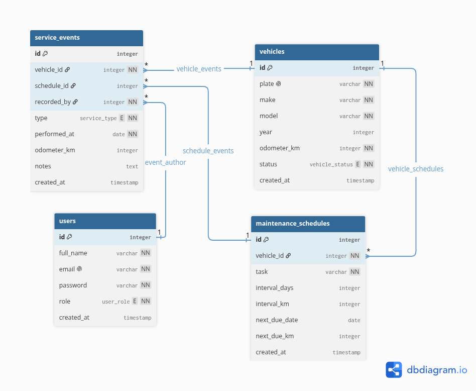

# Data Model

Entity-relationship model for the system described in [`components_diagram.md`](./components_diagram.md).

Edited at [dbdiagram.io](https://dbdiagram.io/d/EMS-68be14fa61a46d388edda3bc).

---

- users: who logs in, and with which role.
- vehicles: one row per vehicle in the fleet.
- maintenance_schedules: the rule that says when a vehicle is due, by days or by kilometres.
- service_events: what was actually done, and by whom.

The whole overdue calculation comes from two tables. `maintenance_schedules` says when the work should happen, `service_events` says when it did. A vehicle is overdue when `next_due_date` has passed and no matching service event has been logged since.

`service_events.schedule_id` is nullable on purpose: a breakdown is real work that no schedule planned, so it is recorded without one.
