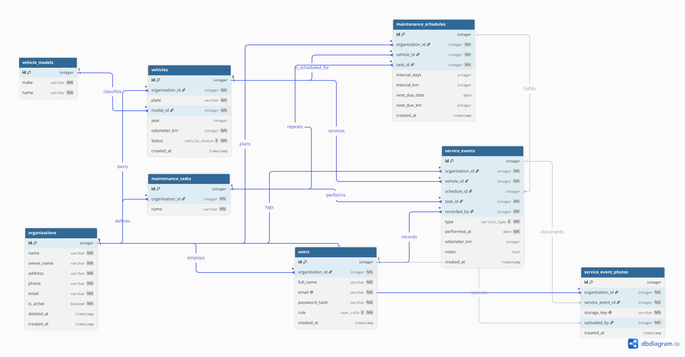

# Data Model

## First version

Four tables. It worked, but two things were repeated:

- Every Chevrolet NHR wrote "Chevrolet" again in its own row.
- The task was plain text, so "Oil change" and "oil change" counted as different work.

## After the feedback

Two new tables, following the professor's note on normalization:

| Table | What it fixes |
|---|---|
| `vehicle_models` | The make is written once. `vehicles` points at it. |
| `maintenance_tasks` | One list of tasks. Schedules and events both point at the same row. |

Second normal form had nothing to fix: every table has a single-column primary key, so partial dependencies cannot happen.

## More than one fleet

The model held one company's fleet and nothing else. Two more tables open it to several, which the professor confirmed is the right shape: what each company sees and is allowed to do gets decided in the business logic, not by handing every client its own database.

| Table | What it adds |
|---|---|
| `organizations` | One row per company. Everything anybody owns points back at it through `organization_id`. |
| `service_event_photos` | The picture the mechanic took. Metadata only: `storage_key` points at the file in the object store. |

`organizations` carries the details the professor asked for: `name`, `owner_name`, `address`, `phone` and `email`, plus `is_active` and `deleted_at`. Those last two are the flag and the soft delete.

The contact block is plain columns, not a link to `users`. The director is who you call about the account and may never log in, and pointing at `users` would be circular anyway, since `users.organization_id` cannot be empty.

Two uniqueness rules changed:

- **`vehicles`** — the plate used to be unique everywhere. Two companies could not both run a van called ABC123, so it is unique per organization now.
- **`maintenance_tasks`** — the coordinator edits this list, so each company keeps its own. One client renaming "Oil change" must not reach into anybody else's schedules.

`vehicle_models` is the exception and stays shared. Nobody owns "Chevrolet NHR" and nobody edits it, so a copy per company would duplicate rows for nothing.

## Roles the client invents

The role was an enum on `users`, so every organization had the same three and none could add a fourth. Clients asked for their own, so it became a row.

| Table | What it adds |
|---|---|
| `roles` | A job title one organization invented, and the only thing `users` points at now. |
| `role_permissions` | One row per permission a role grants. |

Every organization is seeded with a fleet coordinator, a mechanic and an operations manager carrying what the three enum values used to carry. They are ordinary rows from that moment: the client renames them, changes what they grant, or adds a fourth. "Mechanic" here and "Mechanic" somewhere else are separate rows that may mean different things.

The grants are rows rather than an array column on `roles`. An array would be one table fewer and one normal form worse, and the relationship would be hidden inside a value instead of drawn on the diagram.

The list of permissions is not the client's to extend. Each one is a guard or a route that has to exist in code, so `permission` is an enum: a client composes roles out of it and cannot invent an entry.

## Pictures

`vehicles.photo_key` and `service_event_photos.storage_key` both hold a key, never the bytes. The files live in an object store, which is Cloudinary on the free plan: Render's disk is wiped on every deploy and every time the free instance wakes up, so anything written there would not survive the afternoon.

One picture per vehicle, added by editing a van that already exists rather than when it is registered. Sizing happens on delivery, so the fleet table and the profile ask the same stored file for different widths.

The API runs without the credentials, with upload switched off, so a teammate who has not set them up can still work on everything else.

## Rules to know

Due date passed and nobody logged that service = overdue.

`schedule_id` can be empty. A breakdown is work nobody planned.

A role somebody holds cannot be deleted, and the last role granting `manage_team` cannot drop it. Between them that is what stops a client locking itself out of its own team screen, which nobody but a platform admin could undo.

`is_active` and `deleted_at` are not the same thing. `is_active = false` is a suspension the company comes back from; `deleted_at` is gone for good, with the rows kept so the service history still reads. Either one blocks sign-in.

`users.email` is unique across the whole table and a deleted organization keeps its rows, so that address stays taken. Fine while there is one company. Worth revisiting before the second.

## Signing in

Everyone signs in with an email and a password, so `users.email` doubles as
the login identifier and stays unique across the whole table.

`platform_admins` is the one table that stands outside the fleets. Whoever
runs the service is not a member of any of them, and `users.organization_id`
cannot be empty — that rule is what stops a query escaping from one client
into another, so it is worth more than the convenience of one table.

An organization is unreachable when `deleted_at` is set or `is_active` is
false, and sign-in is where that is enforced.

## Reading the diagram

Every line is named with what it does, so the diagram explains itself. An organization `employs` users, `owns` vehicles and `sets_up` roles; a role `grants` permissions and a user `is_assigned` one; a vehicle `is_scheduled_for` maintenance; a user `records` a service event, and a photo `documents` one.

Source: [`data_model.dbml`](./data_model.dbml), edited at [dbdiagram.io](https://dbdiagram.io/d/6a78f2a8829f06bdc8b425db).
