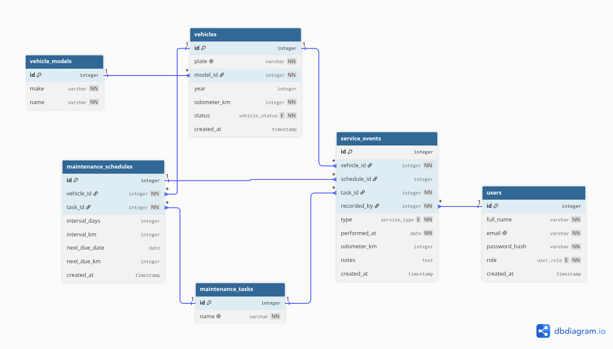

# Data Model

## First version

Four tables. It worked, but two things were repeated:

- Every Chevrolet NHR wrote "Chevrolet" again in its own row.
- The task was plain text, so "Oil change" and "oil change" counted as different work.

## After the feedback

Two new tables, following the professor's note on normalization:

| Table | What it fixes |
|---|---|
| `vehicle_models` | The make is written once. `vehicles` points at it. |
| `maintenance_tasks` | One list of tasks. Schedules and events both point at the same row. |

Second normal form had nothing to fix: every table has a single-column primary key, so partial dependencies cannot happen.

## More than one fleet

The model held one company's fleet and nothing else. Two more tables open it to several, which the professor confirmed is the right shape: what each company sees and is allowed to do gets decided in the business logic, not by handing every client its own database.

| Table | What it adds |
|---|---|
| `organizations` | One row per company. Everything anybody owns points back at it through `organization_id`. |
| `service_event_photos` | The picture the mechanic took. Metadata only: `storage_key` points at the file in the object store. |

`organizations` carries the details the professor asked for: `name`, `owner_name`, `address`, `phone` and `email`, plus `is_active` and `deleted_at`. Those last two are the flag and the soft delete.

The contact block is plain columns, not a link to `users`. The director is who you call about the account and may never log in, and pointing at `users` would be circular anyway, since `users.organization_id` cannot be empty.

Two uniqueness rules changed:

- **`vehicles`** — the plate used to be unique everywhere. Two companies could not both run a van called ABC123, so it is unique per organization now.
- **`maintenance_tasks`** — the coordinator edits this list, so each company keeps its own. One client renaming "Oil change" must not reach into anybody else's schedules.

`vehicle_models` is the exception and stays shared. Nobody owns "Chevrolet NHR" and nobody edits it, so a copy per company would duplicate rows for nothing.

## Rules to know

Due date passed and nobody logged that service = overdue.

`schedule_id` can be empty. A breakdown is work nobody planned.

`is_active` and `deleted_at` are not the same thing. `is_active = false` is a suspension the company comes back from; `deleted_at` is gone for good, with the rows kept so the service history still reads. Either one blocks sign-in.

`users.email` is unique across the whole table and a deleted organization keeps its rows, so that address stays taken. Fine while there is one company. Worth revisiting before the second.

## Reading the diagram

Every line is named with what it does, so the diagram explains itself. An organization `employs` users and `owns` vehicles; a vehicle `is_scheduled_for` maintenance; a user `records` a service event, and a photo `documents` one.

Source: [`data_model.dbml`](./data_model.dbml), edited at [dbdiagram.io](https://dbdiagram.io/d/6a78f2a8829f06bdc8b425db).
