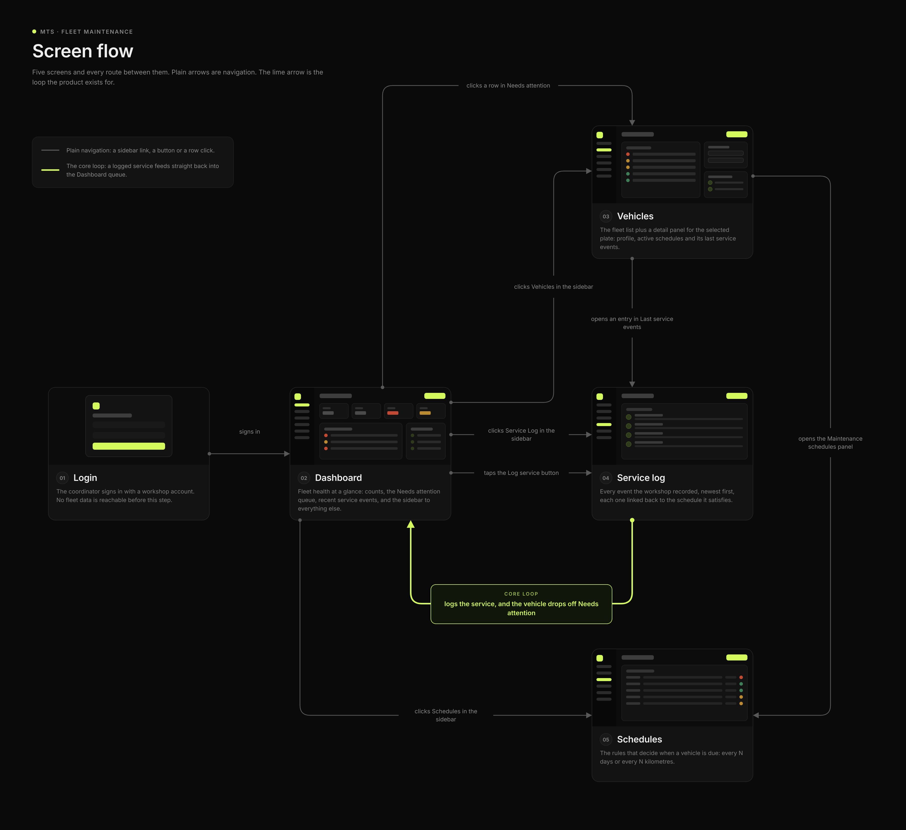

# Mockup

## Flow

The highlighted arrow is the one that matters: a mechanic logs a service and the vehicle leaves the coordinator's "Needs attention" list. Everything else is navigation.

## Screens

What needs attention now, plus recent activity and the fleet at a glance.

The fleet, with the selected vehicle's profile, schedules and last services beside it.

The rules: every N days or N kilometres, when it was last done, when it falls due.

What the workshop recorded. The clutch on MNO345 shows "None, unplanned repair": the nullable `schedule_id` from the data model.

## Brand manual

Status colour always carries meaning: red overdue, amber due soon, green on track. Lime is only ever the primary action.

Source files are the `.pen` files in [`mockups/`](./mockups), edited with the [pen.dev](https://pen.dev) CLI.
