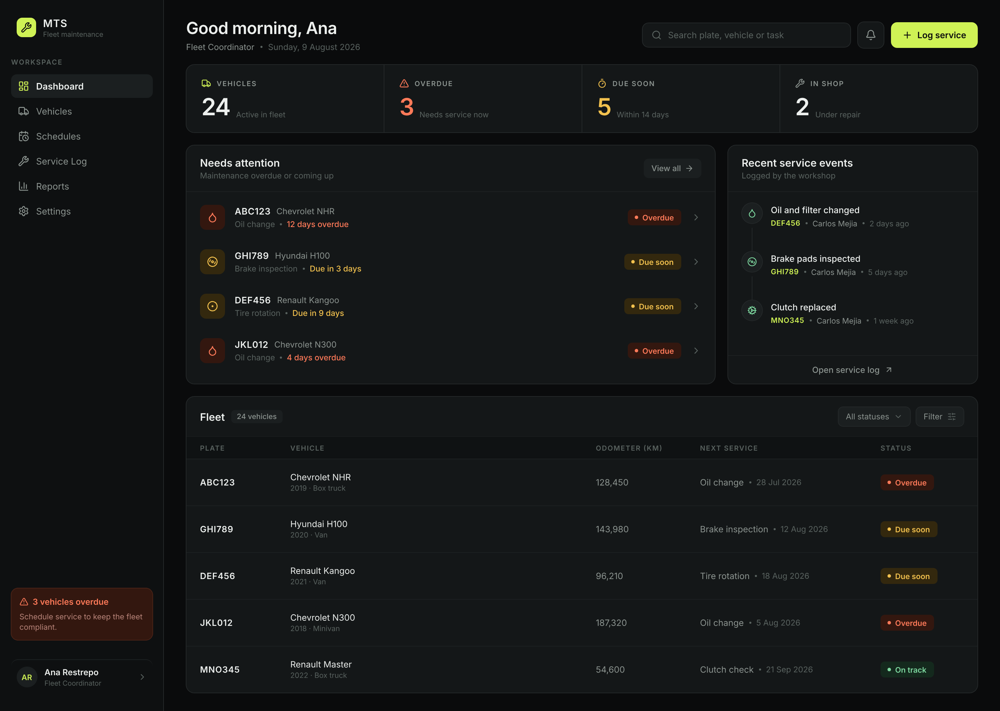
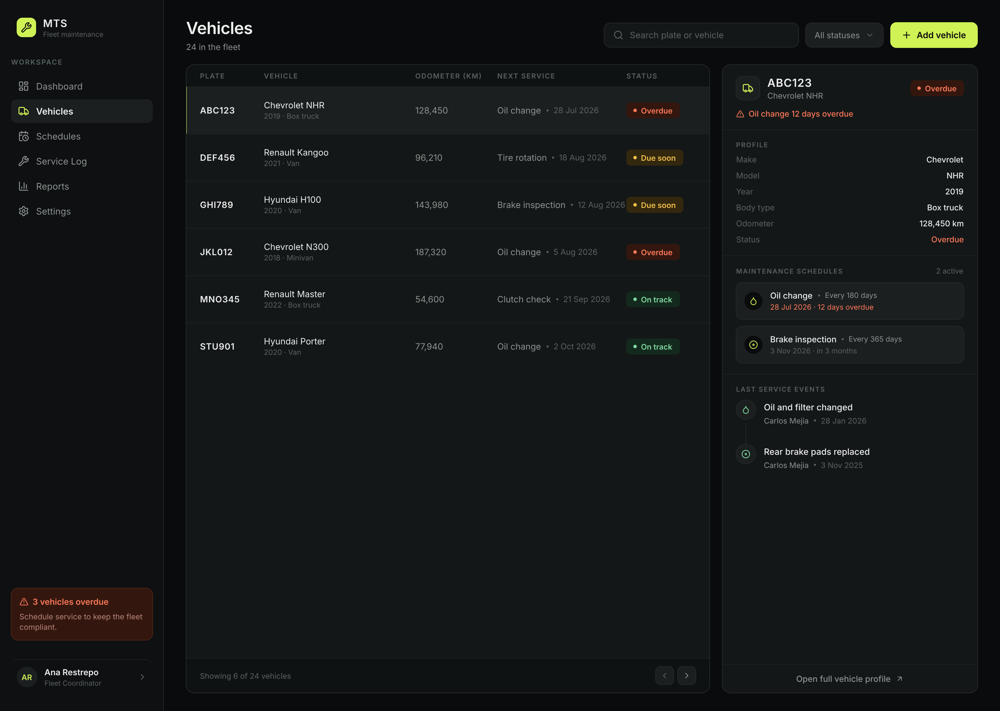
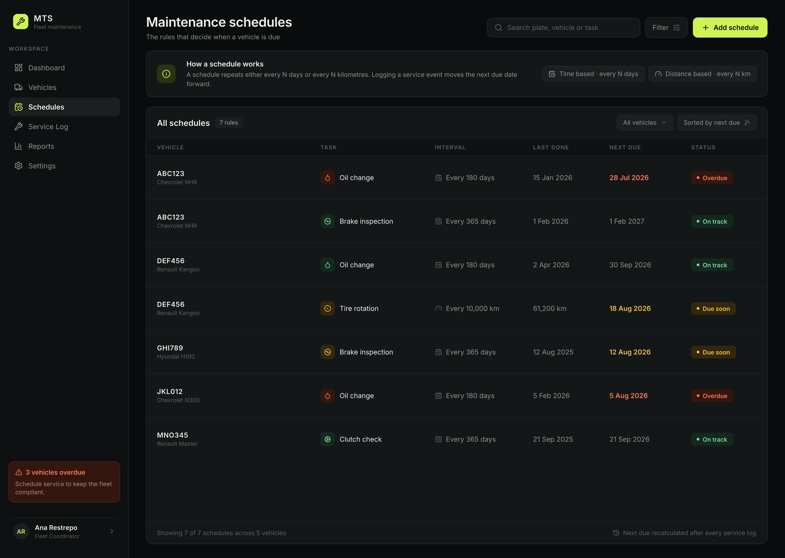
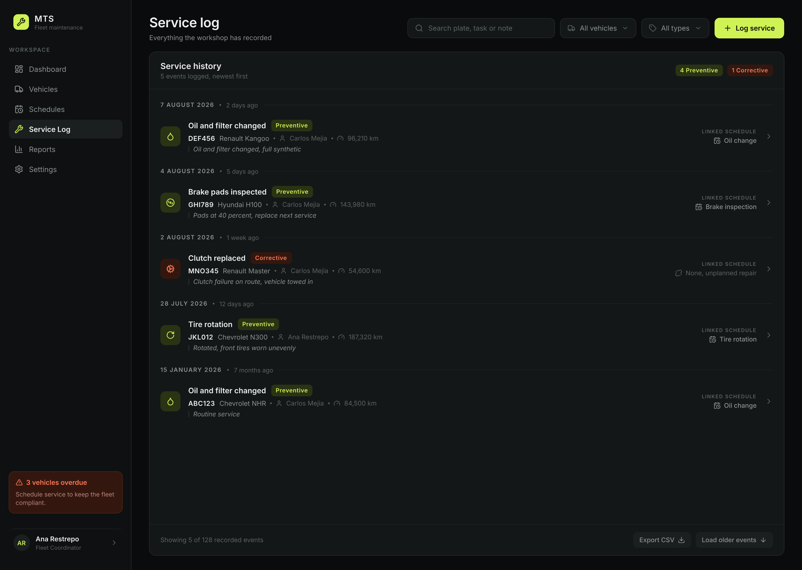
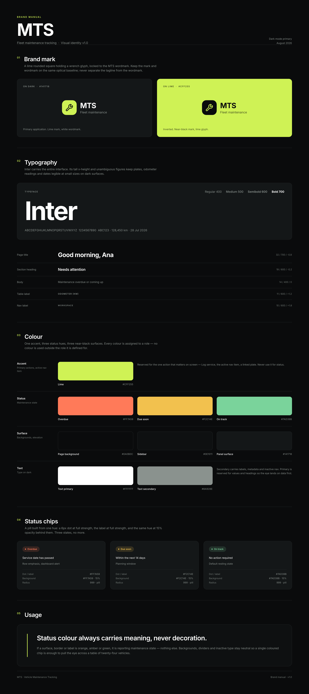

# Mockup

Visual design for the system described in [`architecture_diagram.md`](./architecture_diagram.md), using the data from [`data_model.md`](./data_model.md).

## Dashboard

- Sidebar: navigation, an overdue alert, and the signed-in user.
- Summary cards: vehicles, overdue, due soon, in shop.
- Needs attention: the vehicles that are overdue or coming up, each with its task and status.
- Recent service events: what the workshop logged last.
- Fleet table: plate, vehicle, odometer, next service and status.

## Vehicles

The fleet, with a side panel for the selected vehicle: its profile, its active schedules and its last services. This is where the three tables of the data model meet in one view.

## Schedules

The rules themselves: repeat every N days or every N kilometres, when it was last done, when it falls due next. Logging a service moves the next due date forward.

## Service log

Everything the workshop recorded, newest first, tagged Preventive or Corrective. The clutch on MNO345 shows "None, unplanned repair" under linked schedule — that is the nullable `schedule_id` from the data model, a breakdown no schedule planned.

## Brand manual

- Brand mark on dark and on lime.
- Typography: Inter, its weights, and the type scale used in the product.
- Colour: one accent, three status hues, three surfaces, two text tones, each with its hex and role.
- Status chips: Overdue, Due soon, On track.

Status colour always carries meaning. Overdue is red, due soon is amber, on track is green, and lime is reserved for the primary action — never for status.

Source files are `mockups/dashboard.pen` and `mockups/brand_manual.pen`, edited with the [pen.dev](https://pen.dev) CLI. Reference material sits in [`inspiration/`](./inspiration).
