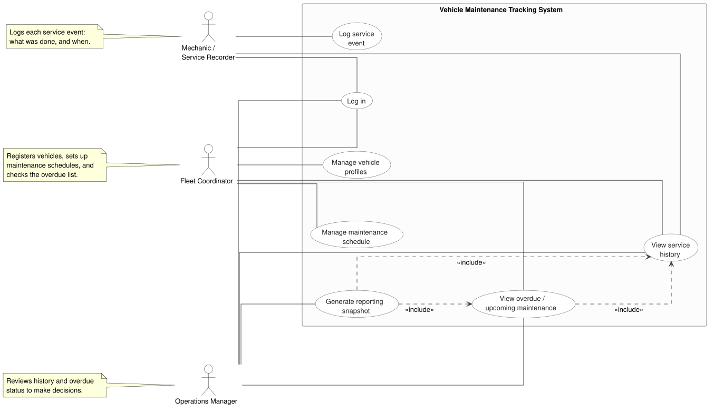

# Use Case Diagram

MVP scope, from [`RFP-012_statement_of_work.md`](../proposals/RFP-012_statement_of_work.md)
and [`RFP-012_software_project_proposal.md`](../proposals/RFP-012_software_project_proposal.md).

---

The three roles do not overlap: the Fleet Coordinator schedules, the Mechanic logs, and the Operations Manager reviews. Each owns a separate part of the workflow, so none of them is a subset of another.